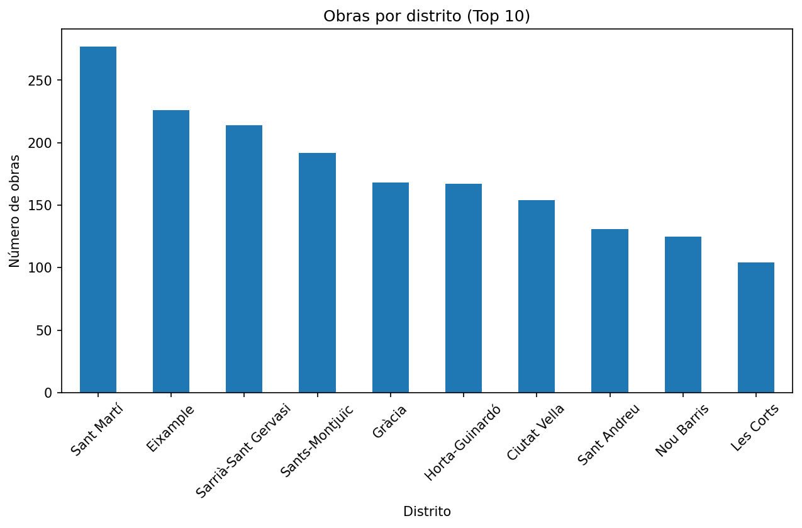
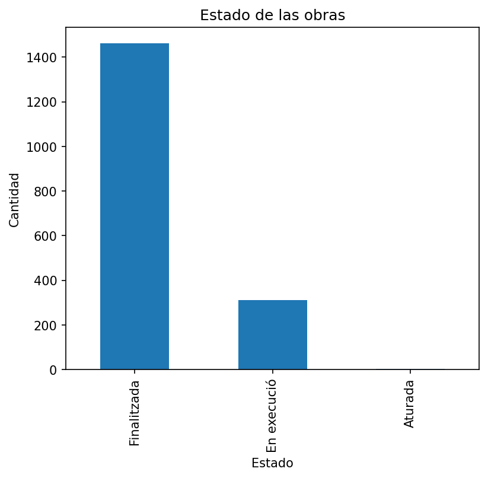
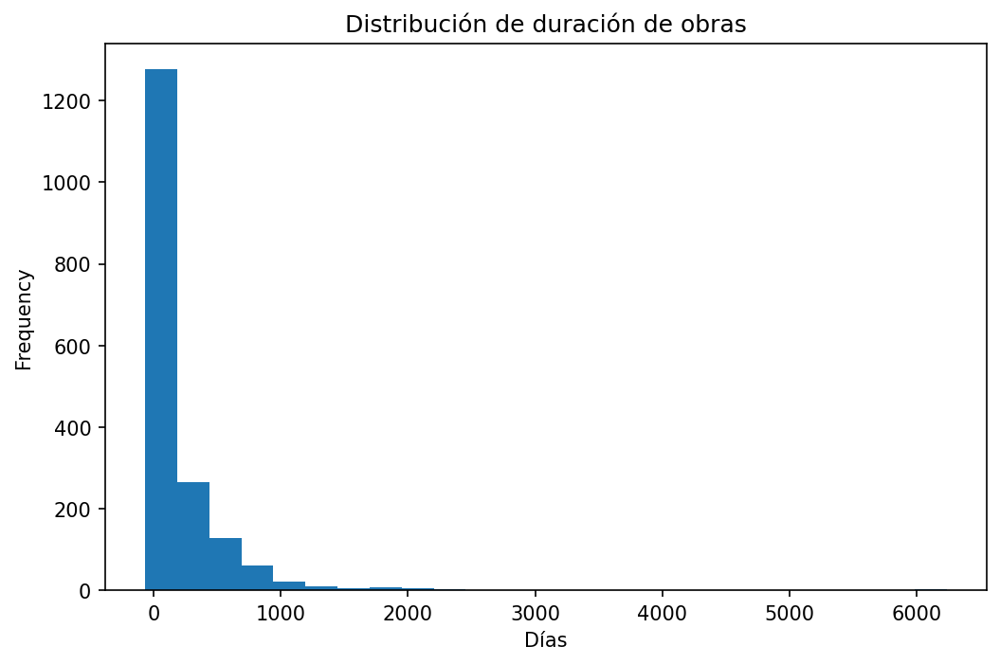
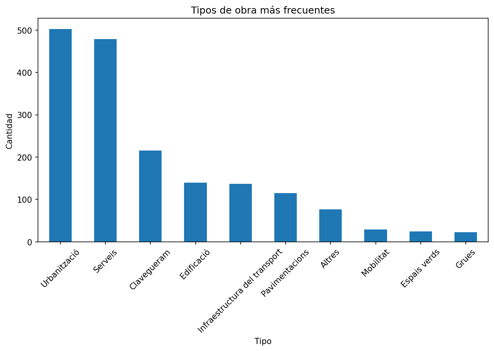

# 🌍 Barcelona Open Data ETL

Proyecto de Ingeniería de Datos que implementa un pipeline ETL (Extract, Transform, Load) utilizando datos abiertos del Ayuntamiento de Barcelona.

El objetivo es demostrar competencias en extracción de datos desde APIs públicas, procesamiento con Python, análisis exploratorio y generación de visualizaciones siguiendo buenas prácticas de desarrollo.

---

## 🎯 Objetivos del proyecto

+ Consumir datos abiertos mediante APIs REST (CKAN).
+ Automatizar la extracción de datasets públicos.
+ Limpiar y transformar los datos utilizando Pandas.
+ Generar un conjunto de datos preparado para análisis.
+ Obtener indicadores y métricas relevantes.
+ Crear visualizaciones automáticas.
+ Preparar los datos para su futura carga en una base de datos relacional.

---

## 🧱 Arquitectura del sistema

```text
Open Data BCN 
  │
  ▼ 
Extracción (Python + Requests) 
  │ 
  ▼
Datos crudos (CSV) 
  │ 
  ▼
Transformación (Pandas) 
  │
  ▼
Datos procesados
  │ 
  ▼ 
Análisis (KPIs) 
  │
  ▼
Visualizaciones (Matplotlib)
  │
  ▼ 
SQLite (próxima fase)
```
---
# 📊 Fuente de datos actual
## 🏗 Obras públicas de Barcelona

Fuente: Open Data BCN

Información disponible:

+ Obras en curso
+ Estado de ejecución
+ Distrito y barrio
+ Fechas de inicio y finalización
+ Presupuestos
+ Empresa constructora
+ Geometría de las actuaciones

## 🌫️ Calidad del aire
Fuente: Ministerio para la Transición Ecológica

Variables:
- NO₂
- PM10
- PM2.5
- Ozono (O₃)
- Datos horarios y diarios por estación

## 🛠 Tecnologías utilizadas

+ Python 3.10
+ Pandas
+ Requests
+ Matplotlib
+ Git
+ GitHub
+ Jupyter Notebook (exploración)
+ SQLite (próximamente)
+ PostgreSQL (evolución futura)

---

```

📁 Estructura del proyecto
barcelona-open-data-etl/ 
│ 
├── codigo/
│   ├── extraccion/ 
│   ├── transformacion/ 
│   ├── visualizacion/ 
│   ├── carga/ 
│   └── utilidades/ 
│   
├── configuracion/ 
│ 
├── datos/ 
│    ├── crudos/ 
│    ├── procesados/ 
│    └── archivo/ 
│    
├── documentacion/ 
│    └── imagenes/ 
│    
├── notebooks/ 
├── pruebas/ 
├── base_datos/ 
│ 
├── README.md 
├── requirements.txt 
└── .gitignore
```

## 🚀 Estado del proyecto

+ ✅ Estructura profesional del proyecto
+ ✅ Repositorio Git y GitHub
+ ✅ Consumo de la API Open Data BCN
+ ✅ Descarga automática del dataset
+ ✅ Limpieza y transformación de datos
+ ✅ Análisis exploratorio (EDA)
+ ✅ Generación automática de gráficos
+ ⏳ Carga en SQLite
+ ⏳ Dashboard interactivo
+ ⏳ Integración de nuevas fuentes de datos

## 🧠 Qué demuestra este proyecto

Este proyecto demuestra habilidades en:

- 1 Consumo de APIs REST
- 2 Procesamiento de datos con Python
- 3 Limpieza y transformación de datos
- 4 Modelado de bases de datos
- 5 SQL para análisis
- 6 Construcción de pipelines ETL
- 7 Buenas prácticas de Git y estructura de proyectos

## 📌 Próximas mejoras

- [ ] Integrar datos de calidad del aire.
- [ ] Cargar los datos en SQLite.
- [ ] Migrar a PostgreSQL.
- [ ] Automatizar el ETL completo.
- [ ] Añadir registro de eventos (logging).
- [ ] Incorporar pruebas unitarias (pytest).
- [ ] Crear un dashboard interactivo con Streamlit.
- [ ] Contenerizar el proyecto con Docker.

## 📊 Resultados obtenidos

A partir del conjunto de datos de obras públicas se han obtenido indicadores como:

+ Número de obras por distrito.
+ Estado de ejecución.
+ Distribución temporal de las obras.
+ Tipología de actuaciones.
+ Análisis de presupuestos.

### Obras por distrito



### Estado de las obras



### Duración de las obras



### Tipos de obra



## 🚀 Competencias demostradas

Este proyecto demuestra conocimientos prácticos en:

+ Consumo de APIs REST (CKAN).
+ Automatización de extracción de datos.
+ Procesamiento de datos con Pandas.
+ Limpieza y transformación de datos.
+ Análisis exploratorio (EDA).
+ Generación de visualizaciones con Matplotlib.
+ Organización de proyectos ETL.
+ Control de versiones mediante Git y GitHub.

## 📌 Próximas mejoras

- ⬜ Incorporar datos de calidad del aire.
- ⬜ Cargar los datos en SQLite.
- ⬜ Migrar el proyecto a PostgreSQL.
- ⬜ Automatizar la ejecución completa del ETL.
- ⬜ Implementar registro de eventos (logging).
- ⬜ Añadir pruebas unitarias con pytest.
- ⬜ Crear un dashboard interactivo con Streamlit.
- ⬜ Contenerizar el proyecto mediante Docker.


## 👤 Autor

Proyecto desarrollado por Israel Mellado como portfolio técnico para demostrar competencias en Ingeniería y Análisis de Datos mediante el desarrollo de un pipeline ETL con datos abiertos.