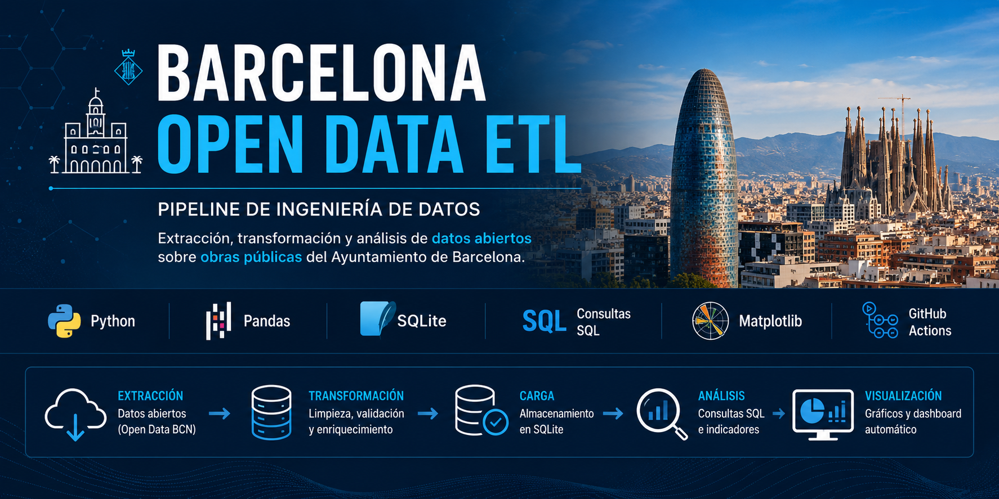
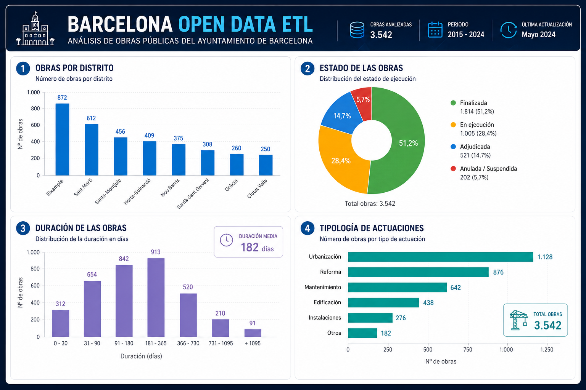
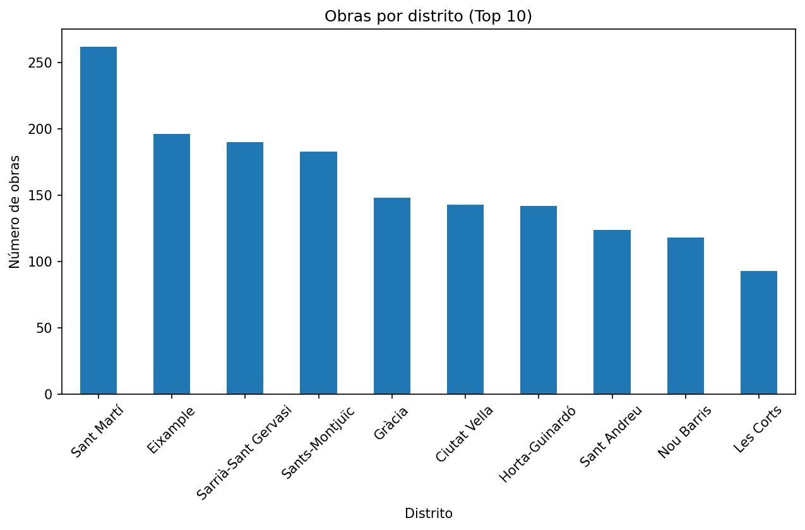
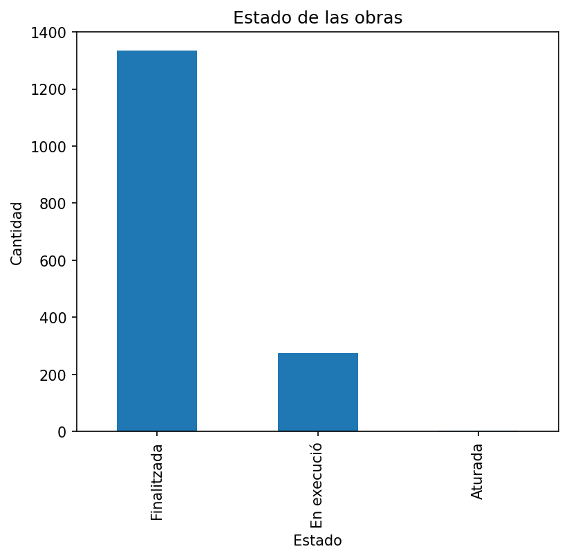
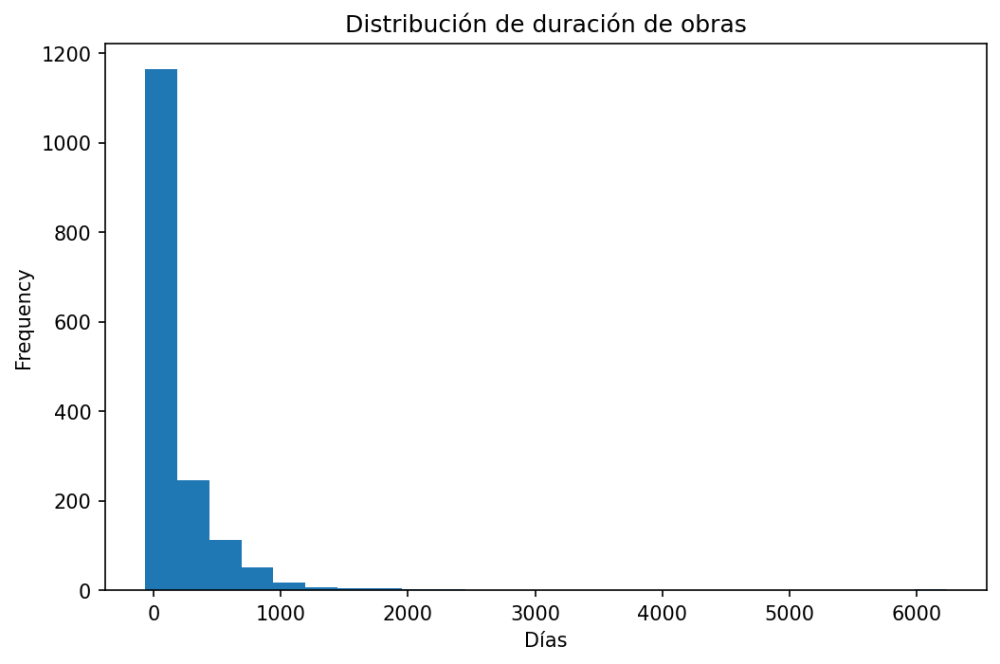
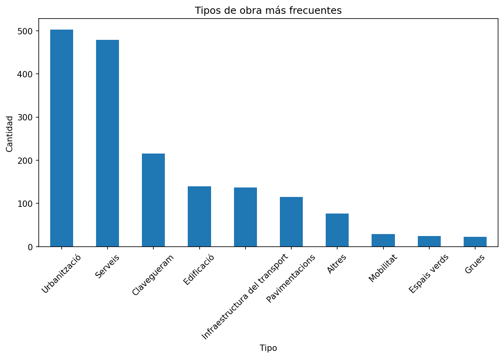

# 🌍 Barcelona Open Data ETL

<!-- markdownlint-disable MD033 -->
<p align="center">
  
</p>
<!-- markdownlint-enable MD033 -->

| TECNOLOGÍAS | | | | |
| --- | --- | --- | --- | --- |
|  |  |  |  |  |
|  |  |  |  | |

---

Proyecto de **Ingeniería de Datos** que implementa un **pipeline ETL (Extract · Transform · Load)** utilizando datos abiertos del Ayuntamiento de Barcelona.

El proyecto automatiza la descarga, limpieza, transformación, almacenamiento y análisis de información sobre las obras públicas de Barcelona mediante Python, SQLite y SQL.

---

El proyecto automatiza la descarga, transformación, almacenamiento y análisis de información sobre las obras públicas de la ciudad, aplicando buenas prácticas de desarrollo, pruebas automatizadas e integración continua.

---

## 📌 Características principales

- Descarga automática del dataset desde Open Data Barcelona.
- Limpieza y transformación de datos con Pandas.
- Almacenamiento en SQLite.
- Ejecución automática de consultas SQL.
- Generación de visualizaciones con Matplotlib.
- Pipeline ETL completamente automatizado.

---

## 📸 Vista previa



---

## 🎯 Objetivos del proyecto

Este proyecto ha sido desarrollado como portfolio técnico para demostrar conocimientos en Ingeniería de Datos mediante la construcción de un pipeline ETL completo.

Los principales objetivos son:

- Consumir datos abiertos mediante APIs públicas (CKAN).
- Automatizar la extracción de datasets.
- Limpiar y transformar datos utilizando Pandas.
- Almacenar la información en una base de datos SQLite.
- Ejecutar consultas SQL para obtener indicadores.
- Generar visualizaciones de forma automática.
- Aplicar buenas prácticas de desarrollo con Git, GitHub y CI/CD.

---

## Vista previa


## ⚙️ Instalación

Clona el repositorio:

```bash
git clone https://github.com/israelmellado/datos-abiertos-barcelona-etl.git
cd datos-abiertos-barcelona-etl
```

Crea un entorno virtual:

```bash
python -m venv .venv
```

### Windows

```bash
.venv\Scripts\activate
```

### Linux / macOS

```bash
source .venv/bin/activate
```

Instala las dependencias:

```bash
pip install -r requirements.txt
```

---

## ▶️ Ejecución

Para ejecutar el pipeline completo:

```bash
python codigo/pipeline.py
```

El pipeline realiza automáticamente:

- Descarga del dataset.
- Limpieza y transformación de datos.
- Creación de la base de datos SQLite.
- Carga de los datos.
- Ejecución de consultas SQL.
- Generación de gráficos.

## 📊 Fuente de datos

**Dataset:** Obras en el espacio público de Barcelona.

**Proveedor:** Ayuntamiento de Barcelona – Open Data BCN.

**Información disponible:**

- Código de la obra.
- Distrito y barrio.
- Tipo de actuación.
- Estado de la obra.
- Fechas de inicio y finalización.
- Presupuesto de licitación.
- Presupuesto de adjudicación.
- Empresa promotora.
- Empresa constructora.
- Geometría (WGS84).

---

## 🛠 Tecnologías utilizadas

| Tecnología | Uso |
| --- | --- |
| Python 3.10 | Desarrollo del pipeline ETL |
| Pandas | Limpieza y transformación de datos |
| Requests | Descarga automática del dataset |
| SQLite | Almacenamiento de datos |
| Matplotlib | Generación de gráficos |
| Git | Control de versiones |
| GitHub | Alojamiento del repositorio |
| GitHub Actions | Integración continua (CI) |
| Pytest | Pruebas automatizadas |
| Black | Formateo automático del código |
| Ruff | Análisis estático y calidad del código |

---

## 🏗️ Arquitectura del sistema

El proyecto implementa un pipeline ETL completo para la obtención, procesamiento y análisis de datos abiertos del Ayuntamiento de Barcelona.

```text
                 Open Data Barcelona
                        │
                        ▼
              Descarga del dataset
                 (Requests + CSV)
                        │
                        ▼
                        ▼
              Datos crudos (CSV)
                        │
                        ▼
        Transformación y limpieza (Pandas)
                        │
                        ▼
            Datos procesados (CSV)
                        │
                        ▼
          Carga en base de datos SQLite
                        │
          ┌─────────────┴─────────────┐
          ▼                           ▼
   Consultas SQL              Visualizaciones
          │                           │
          └─────────────┬─────────────┘
                        ▼
              Dashboard e indicadores
```

---

## ⚡ Flujo del pipeline

El pipeline ejecuta automáticamente las siguientes etapas:

1. Descarga del conjunto de datos desde Open Data Barcelona.
2. Limpieza y transformación del dataset.
3. Creación de la base de datos SQLite.
4. Carga de los registros.
5. Ejecución de consultas SQL.
6. Generación de gráficos e indicadores.

---

## 📂 Estructura del proyecto

```text
barcelona-open-data-etl/
│
├── .github/
│   └── workflows/
│       └── python-tests.yml
│
├── base_datos/
│   ├── consultas/
│   ├── modelos/
│   └── sqlite/      Base de datos SQLite generada por el ETL.
│       └── barcelona.db
│
├── codigo/
│   ├── analisis/
│   ├── carga/
│   ├── configuracion/
│   │   └── config.py
│   ├── dashboard/   Dashboard interactivo desarrollado con Streamlit.
│   │   ├── app.py
│   │   ├── datos.py
│   │   ├── filtros.py
│   │   ├── graficos.py
│   │   ├── kpis.py
│   │   ├── mapas.py
│   │   └── utils.py
│   ├── extraccion/  Obtención de datos desde Open Data BCN.
│   ├── transformacion/     Limpieza y transformación del dataset.
│   ├── utilidades/
│   ├── visualizacion/
│   └── pipeline.py
│
├── datos/
│   ├── crudos/
│   ├── procesados/
│   └── archivo/
│
├── documentacion/   Documentación técnica y recursos del proyecto.
│   ├── imagenes/
│   ├── analisis_fuentes_datos.md
│   ├── arquitectura_etl.md
│   └── decisiones_tecnicas.md
│
├── notebooks/
│
├── pruebas/         Pruebas unitarias con Pytest
│   ├── test_bd.py
│   ├── test_config.py
│   ├── test_consultas.py
│   ├── test_dashboard.py
│   ├── test_extraccion.py
│   └── test_transformacion.py
│
├── logs/
│
├── .gitignore
├── .pre-commit-config.yaml
├── LICENSE
├── README.md
├── requirements.txt
└── pyproject.toml
```

---

## ✅ Integración continua

El proyecto utiliza **GitHub Actions** para validar automáticamente cada cambio enviado al repositorio.

En cada *push* o *pull request* se ejecutan automáticamente las siguientes tareas:

- Instalación de dependencias.
- Ejecución completa del pipeline ETL.
- Verificación de la estructura del proyecto.
- Validación de la base de datos SQLite.
- Ejecución de todas las pruebas con Pytest.

Esto garantiza que el pipeline continúa funcionando correctamente tras cada modificación del código.

---

## 🧪 Pruebas automatizadas

El proyecto incorpora pruebas desarrolladas con **Pytest** para verificar el correcto funcionamiento de todos los componentes principales.

Las pruebas incluyen:

- Validación de la configuración del proyecto.
- Descarga correcta del dataset.
- Transformación y limpieza de datos.
- Creación de la base de datos SQLite.
- Ejecución de consultas SQL.
- Generación de gráficos.
- Validación del dashboard.
- Comprobación de la integridad de los datos.

Actualmente el proyecto dispone de más de **20 pruebas automáticas**, ejecutadas tanto de forma local como mediante GitHub Actions.

## 📊 Resultados obtenidos

El pipeline procesa automáticamente el conjunto de datos de obras públicas de Barcelona y genera información preparada para su análisis.

Entre los resultados obtenidos destacan:

- Eliminación de registros duplicados.
- Normalización de campos y fechas.
- Cálculo de la duración de las obras.
- Carga automática en SQLite.
- Ejecución de consultas SQL.
- Generación de gráficos de forma automática.

Las consultas SQL permiten obtener indicadores como:

- Número de obras por distrito.
- Estado de ejecución de las obras.
- Duración media de los proyectos.
- Tipología de actuaciones.
- Presupuesto medio de licitación y adjudicación.
- Constructoras con mayor número de obras.

---

## 📈 Visualizaciones

El pipeline genera automáticamente los siguientes gráficos:

### 📍 Obras por distrito

Distribución del número de obras públicas por distrito de Barcelona.



---

### 🚧 Estado de las obras

Resumen del estado de ejecución de las actuaciones registradas en el dataset.



---

### 📅 Duración de las obras

Distribución de la duración de las obras expresada en días.



---

### 🏗 Tipología de actuaciones

Clasificación de las obras según el tipo de actuación realizada.



---

## 🚀 Estado del proyecto

Actualmente el proyecto dispone de las siguientes funcionalidades implementadas:

- ✅ Estructura profesional del proyecto.
- ✅ Pipeline ETL completamente automatizado.
- ✅ Descarga automática del dataset.
- ✅ Limpieza y transformación de datos.
- ✅ Almacenamiento en SQLite.
- ✅ Consultas SQL automatizadas.
- ✅ Generación automática de gráficos.
- ✅ Sistema de logging.
- ✅ Pruebas automatizadas con Pytest.
- ✅ Integración continua mediante GitHub Actions.
- ✅ Formateo automático con Black.
- ✅ Análisis estático del código con Ruff.

---

## 💼 Competencias demostradas

Este proyecto ha sido desarrollado para demostrar conocimientos prácticos en Ingeniería de Datos y Análisis de Datos.

Durante su desarrollo se han aplicado conceptos relacionados con:

- Desarrollo de pipelines ETL.
- Consumo de APIs REST (CKAN).
- Automatización de procesos con Python.
- Limpieza y transformación de datos con Pandas.
- Modelado y carga de bases de datos SQLite.
- Consultas SQL para análisis de datos.
- Generación de visualizaciones con Matplotlib.
- Testing automatizado con Pytest.
- Integración continua mediante GitHub Actions.
- Calidad del código con Black y Ruff.
- Organización profesional de proyectos Python.
- Control de versiones mediante Git y GitHub.

---

## 📈 Métricas del proyecto

- 🐍 Python 3.10
- 📦 Más de 25 módulos Python.
- 🧪 Más de 20 pruebas automatizadas.
- 🗄 Base de datos SQLite.
- 📊 Dashboard generado automáticamente.
- ⚙️ Pipeline ETL completo.
- 🔄 Integración continua (CI).
- 📝 Sistema de logging.

---

## 📌 Próximas mejoras

El proyecto continuará evolucionando con nuevas funcionalidades y tecnologías propias de un entorno profesional de Ingeniería de Datos.

Las próximas mejoras previstas son:

- ⬜ Integración de nuevos datasets de Open Data Barcelona.
- ⬜ Migración de SQLite a PostgreSQL.
- ⬜ Desarrollo de un dashboard interactivo con Streamlit.
- ⬜ Contenerización mediante Docker.
- ⬜ Parametrización del pipeline utilizando `argparse`.
- ⬜ Planificación automática mediante GitHub Actions.
- ⬜ Exportación de indicadores en formatos Excel y PDF.
- ⬜ Incorporación de nuevas métricas y KPIs.
- ⬜ Despliegue del dashboard en la nube.

---

## 📂 Estructura general del pipeline

```text
Open Data Barcelona
        │
        ▼
 Descarga del dataset
        │
        ▼
 Datos crudos (CSV)
        │
        ▼
 Limpieza y transformación
        │
        ▼
 Datos procesados
        │
        ▼
 Base de datos SQLite
        │
        ├──────────────┐
        ▼              ▼
 Consultas SQL     Visualizaciones
        │              │
        └──────┬───────┘
               ▼
      Dashboard e indicadores
```

---

## 👤 Autor

### Israel Mellado

Proyecto desarrollado como portfolio técnico para demostrar competencias en:

- Ingeniería de Datos.
- Análisis de Datos.
- Desarrollo de pipelines ETL.
- Automatización con Python.
- SQL y bases de datos.
- Testing e Integración Continua.

[GitHub:](https://github.com/israelmellado)

---

## 📄 Licencia

Este proyecto se distribuye con fines educativos y de portfolio.

Los datos utilizados pertenecen al portal **Open Data Barcelona** y están sujetos a las condiciones de uso establecidas por el Ayuntamiento de Barcelona.

---

## ⭐ Si te ha resultado interesante

Si este proyecto te ha servido como referencia o te ha parecido útil, puedes darle una ⭐ al repositorio.

Toda sugerencia, mejora o contribución será bienvenida.
